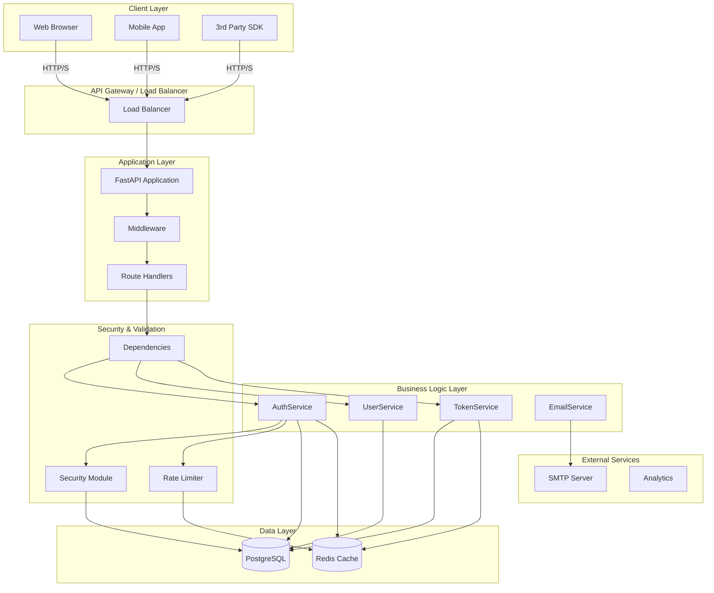
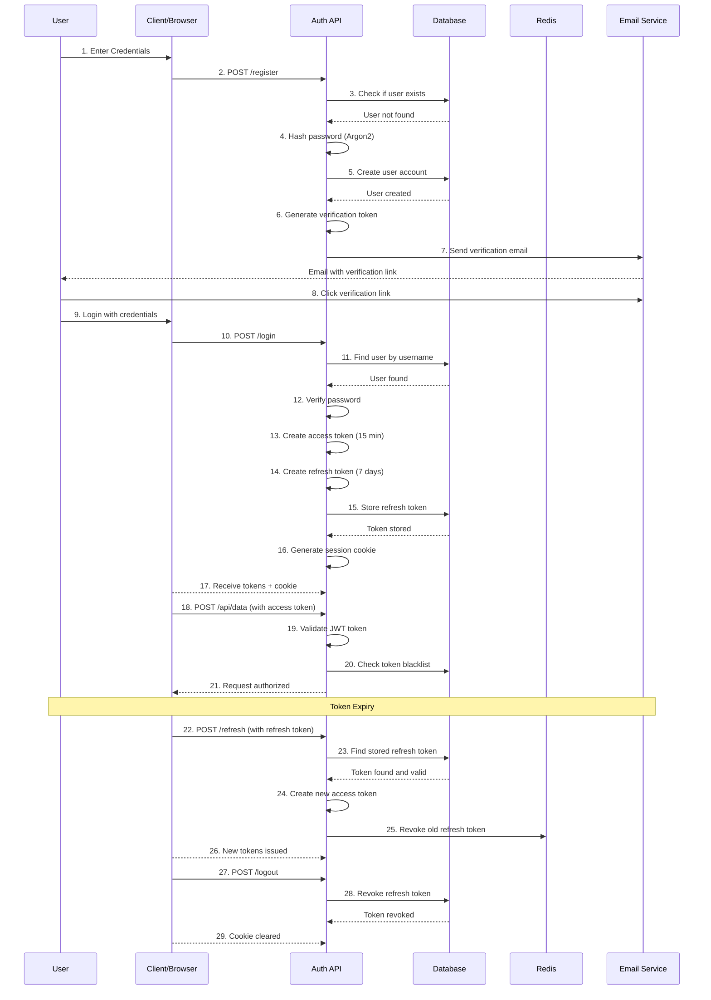
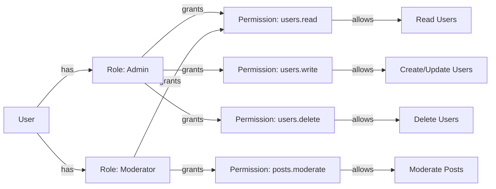
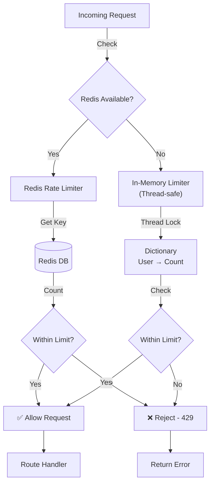
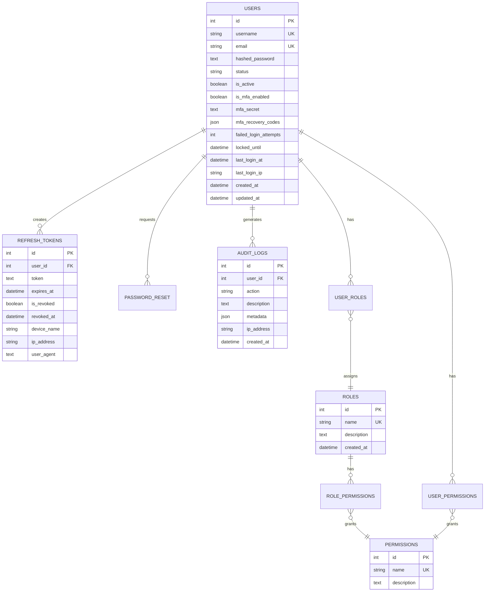

# System Architecture

## Component Diagram



## Authentication Flow Diagram



## Authorization & Role Flow



## Rate Limiting Architecture



## Database Schema Overview



## Security Layers

```
┌─────────────────────────────────────────────────────────────┐
│ 1. NETWORK LAYER                                             │
│ ├─ HTTPS/TLS Encryption (in transit)                       │
│ ├─ HSTS Headers (force HTTPS)                              │
│ └─ Certificate Pinning (optional)                           │
└─────────────────────────────────────────────────────────────┘
                           ↓
┌─────────────────────────────────────────────────────────────┐
│ 2. HTTP HEADER LAYER                                         │
│ ├─ Content-Security-Policy (prevent XSS)                   │
│ ├─ X-Frame-Options: DENY (prevent clickjacking)            │
│ ├─ X-Content-Type-Options: nosniff                         │
│ ├─ Referrer-Policy: strict-origin-when-cross-origin        │
│ └─ Permissions-Policy (restrict browser features)           │
└─────────────────────────────────────────────────────────────┘
                           ↓
┌─────────────────────────────────────────────────────────────┐
│ 3. AUTHENTICATION LAYER                                      │
│ ├─ Argon2 Password Hashing                                 │
│ ├─ Secure Password Requirements                            │
│ ├─ Account Lockout (5 failed attempts)                     │
│ ├─ JWT Token with JTI (unique ID)                          │
│ └─ Token Expiration & Refresh                              │
└─────────────────────────────────────────────────────────────┘
                           ↓
┌─────────────────────────────────────────────────────────────┐
│ 4. AUTHORIZATION LAYER                                       │
│ ├─ Role-Based Access Control (RBAC)                        │
│ ├─ Permission-Based Access Control                         │
│ ├─ Scope-based access                                       │
│ └─ Resource-level permissions                              │
└─────────────────────────────────────────────────────────────┘
                           ↓
┌─────────────────────────────────────────────────────────────┐
│ 5. DATA LAYER                                                │
│ ├─ SQL Injection Prevention (parameterized queries)        │
│ ├─ Row-Level Security (RLS)                                │
│ ├─ Column-level encryption (sensitive data)                │
│ ├─ Database-level SSL/TLS                                  │
│ └─ Audit Trail (all changes logged)                        │
└─────────────────────────────────────────────────────────────┘
                           ↓
┌─────────────────────────────────────────────────────────────┐
│ 6. APPLICATION LAYER                                         │
│ ├─ Rate Limiting (per IP, per endpoint)                    │
│ ├─ Input Validation (Pydantic models)                      │
│ ├─ CORS Policy                                             │
│ ├─ Logging & Monitoring                                    │
│ └─ Error Handling (no sensitive data leaks)                │
└─────────────────────────────────────────────────────────────┘
```

## Deployment Architecture

### Single Server
```
┌─────────────────────────────────────┐
│         Single Server               │
├─────────────────────────────────────┤
│  Docker Container                   │
│  ├─ FastAPI App                     │
│  ├─ PostgreSQL                      │
│  └─ Redis                           │
└─────────────────────────────────────┘
```

### Microservices
```
┌──────────────────────────────────────────────────────────┐
│  API Gateway (Load Balancer)                             │
└───────────┬────────────────────────────┬────────────────┘
            │                            │
     ┌──────▼───────┐         ┌──────────▼────────┐
     │Auth Service  │         │User Service       │
     │Container 1   │         │Container 2        │
     └──────┬───────┘         └──────────┬────────┘
            │                            │
            └──────────────┬─────────────┘
                           │
            ┌──────────────┼──────────────┐
            │              │              │
      ┌─────▼──┐    ┌─────▼──┐    ┌─────▼──┐
      │PostgreSQL  │    │ Redis │    │ Kafka │
      │  Shared    │    │       │    │       │
      └──────────┘    └───────┘    └───────┘
```

### Kubernetes
```
┌────────────────────────────────────────────────┐
│  Kubernetes Cluster                            │
├────────────────────────────────────────────────┤
│  ┌──────────────────────────────────────────┐ │
│  │ Ingress Controller                       │ │
│  └───────────────┬──────────────────────────┘ │
│                  │                            │
│  ┌───────────────▼──────────────────────────┐ │
│  │ Service: auth-service                    │ │
│  └───────────────┬──────────────────────────┘ │
│                  │                            │
│  ┌───────────────▼────────────┐              │
│  │ Deployment: auth-app       │              │
│  │ ├─ Replica 1              │              │
│  │ ├─ Replica 2              │              │
│  │ └─ Replica 3              │              │
│  └─────────────────────────────┘             │
│                                              │
│  ┌──────────────────────────────────────────┐ │
│  │ StatefulSet: postgres-db                 │ │
│  └──────────────────────────────────────────┘ │
│                                              │
│  ┌──────────────────────────────────────────┐ │
│  │ StatefulSet: redis-cache                 │ │
│  └──────────────────────────────────────────┘ │
└────────────────────────────────────────────────┘
```

## Key Design Principles

### 1. **Separation of Concerns**
- Routes (API endpoints)
- Services (business logic)
- Models (data objects)
- Schemas (validation & serialization)

### 2. **Security by Default**
- Secure configuration out of the box
- Validation on every input
- Error messages don't leak sensitive info
- Logging for audit trail

### 3. **Scalability**
- Redis for distributed rate limiting
- Stateless API design
- Database connection pooling
- Async/await throughout

### 4. **Maintainability**
- Clear module organization
- Type hints everywhere
- Comprehensive error handling
- Extensive documentation

### 5. **Reusability**
- Can be used as:
  - Standalone microservice
  - Embedded in FastAPI project
  - Python package
  - Docker container

---

See [Integration Guide](../integration/INTEGRATION_GUIDE.md) for deployment options.
