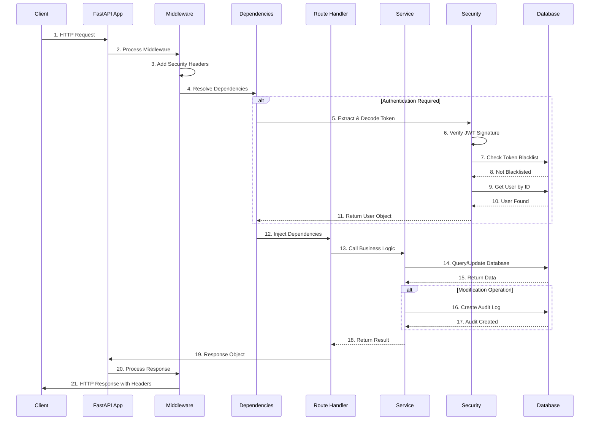
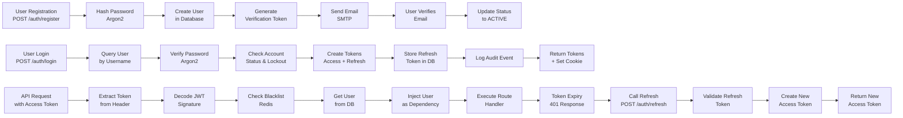

# Module Connections & Data Flow Diagram

## Complete Module Connection Diagram

```mermaid
graph TB
    subgraph "API Layer"
        AUTH_ROUTE["📍 /auth Routes"]
        USER_ROUTE["📍 /users Routes"]
        ROLE_ROUTE["📍 /roles Routes"]
    end
    
    subgraph "Dependency Injection"
        DEPENDS["get_current_user"]
        DEPENDS_ACTIVE["get_current_active_user"]
        DEPENDS_ROLES["require_roles"]
        DEPENDS_PERMS["require_permissions"]
    end
    
    subgraph "Services (Business Logic)"
        AUTH_SVC["AuthService"]
        USER_SVC["UserService"]
        TOKEN_SVC["TokenService"]
        EMAIL_SVC["EmailService"]
    end
    
    subgraph "Security & Validation"
        SECURITY["security.py"]
        VALIDATORS["validators"]
        RATE_LIMIT["RateLimiter"]
    end
    
    subgraph "Data Models"
        USER_MODEL["User"]
        ROLE_MODEL["Role"]
        PERM_MODEL["Permission"]
        TOKEN_MODEL["RefreshToken"]
        AUDIT_MODEL["AuditLog"]
        PWD_RESET["PasswordReset"]
    end
    
    subgraph "External Services"
        DB[(PostgreSQL)]
        REDIS[(Redis)]
        SMTP["SMTP Server"]
    end
    
    subgraph "Configuration"
        CONFIG["config.py"]
        ENV[".env File"]
    end
    
    %% API Routes
    AUTH_ROUTE -->|calls| AUTH_SVC
    USER_ROUTE -->|calls| USER_SVC
    ROLE_ROUTE -->|uses| ROLE_MODEL
    
    %% Dependency Injection
    AUTH_ROUTE -->|uses| RATE_LIMIT
    AUTH_ROUTE -->|uses| DEPENDS
    USER_ROUTE -->|uses| DEPENDS_ACTIVE
    DEPENDS -->|validates| SECURITY
    DEPENDS_ACTIVE -->|checks| USER_MODEL
    DEPENDS_ROLES -->|checks| ROLE_MODEL
    DEPENDS_PERMS -->|checks| PERM_MODEL
    
    %% Services calling models
    AUTH_SVC -->|creates/queries| USER_MODEL
    AUTH_SVC -->|creates| TOKEN_MODEL
    AUTH_SVC -->|uses| EMAIL_SVC
    AUTH_SVC -->|creates| AUDIT_MODEL
    
    USER_SVC -->|queries/updates| USER_MODEL
    USER_SVC -->|manages| ROLE_MODEL
    TOKEN_SVC -->|manages| TOKEN_MODEL
    EMAIL_SVC -->|sends to| SMTP
    
    %% Security
    SECURITY -->|hashes passwords| USER_MODEL
    SECURITY -->|creates/validates JWT| TOKEN_MODEL
    RATE_LIMIT -->|uses| REDIS
    VALIDATORS -->|validates input| AUTH_ROUTE
    
    %% Database
    USER_MODEL -->|persists to| DB
    ROLE_MODEL -->|persists to| DB
    PERM_MODEL -->|persists to| DB
    TOKEN_MODEL -->|persists to| DB
    AUDIT_MODEL -->|persists to| DB
    PWD_RESET -->|persists to| DB
    
    %% Configuration
    CONFIG -->|loads from| ENV
    AUTH_SVC -->|reads| CONFIG
    USER_SVC -->|reads| CONFIG
    SECURITY -->|reads| CONFIG
    RATE_LIMIT -->|reads| CONFIG
    
    %% Cache
    REDIS -->|stores| TOKEN_MODEL
    REDIS -->|stores blacklist| SECURITY
    REDIS -->|stores rate limits| RATE_LIMIT
    
    %% Styling
    classDef api fill:#4CAF50,stroke:#45a049,color:#fff
    classDef service fill:#2196F3,stroke:#0b7dda,color:#fff
    classDef model fill:#FF9800,stroke:#e68900,color:#fff
    classDef external fill:#f44336,stroke:#da190b,color:#fff
    classDef security fill:#9C27B0,stroke:#7b1fa2,color:#fff
    classDef config fill:#00BCD4,stroke:#0097a7,color:#fff
    
    class AUTH_ROUTE,USER_ROUTE,ROLE_ROUTE api
    class AUTH_SVC,USER_SVC,TOKEN_SVC,EMAIL_SVC service
    class USER_MODEL,ROLE_MODEL,PERM_MODEL,TOKEN_MODEL,AUDIT_MODEL,PWD_RESET model
    class DB,REDIS,SMTP external
    class SECURITY,VALIDATORS,RATE_LIMIT,DEPENDS,DEPENDS_ACTIVE,DEPENDS_ROLES,DEPENDS_PERMS security
    class CONFIG,ENV config
```



## Request Flow Diagram



## Authentication Flow Detailed



## Data Dependency Graph

```
User Model
├── depends on: UserStatus enum
├── relationships:
│   ├── RefreshToken (1:many)
│   ├── PasswordResetToken (1:many)
│   ├── AuditLog (1:many)
│   ├── UserRole (1:many)
│   │   └── depends on: Role model
│   │       └── depends on: Permission model
│   └── UserPermission (1:many)
│       └── depends on: Permission model
└── validations:
    ├── username format (regex)
    ├── email format
    ├── phone format (E.164)
    └── stored procedures for RLS

RefreshToken Model
├── depends on: User model
├── fields:
│   ├── token (unique)
│   ├── expires_at (datetime)
│   ├── is_revoked (boolean)
│   ├── ip_address (IPv4/IPv6)
│   └── device_name
└── operations:
    ├── Create on login
    ├── Revoke on logout
    └── Query for device management

Role Model
├── depends on: Permission model
├── relationships:
│   ├── Permission (M:M)
│   ├── User (M:M via UserRole)
│   └── RolePermission join table
└── operations:
    ├── Create role
    ├── Assign permissions
    └── Assign to users

Permission Model
├── fields:
│   ├── name (e.g., users.create)
│   ├── description
│   └── resource_type
└── operations:
    ├── Create permission
    └── Grant to roles/users

AuditLog Model
├── tracks:
│   ├── user_id
│   ├── action (REGISTER, LOGIN, etc)
│   ├── ip_address
│   ├── user_agent
│   └── metadata (JSON)
└── operations:
    └── Append-only logging
```

## Configuration Dependency Tree

```
settings (from config.py)
├── Environment Variables (from .env)
│   ├── SECRET_KEY (used by: security.py, JWT encoding)
│   ├── ALGORITHM (used by: security.py)
│   ├── ACCESS_TOKEN_EXPIRE_MINUTES (used by: security.py)
│   ├── REFRESH_TOKEN_EXPIRE_DAYS (used by: security.py, services)
│   ├── ARGON2_* (used by: security.py, password hashing)
│   ├── DB_HOST, DB_PORT, DB_NAME, DB_USER, DB_PASSWORD (used by: database.py)
│   ├── REDIS_URL (used by: rate_limit.py, services)
│   ├── MAIL_* (used by: email_servics.py)
│   ├── ALLOWED_ORIGINS (used by: main.py, CORS middleware)
│   └── LOG_LEVEL (used by: main.py, logging)
└── Validated at startup
    ├── SECRET_KEY minimum length check
    ├── ARGON2 parameters validation
    ├── DB_SSL_MODE validation
    ├── ALLOWED_ORIGINS not empty
    └── Raises error if invalid
```

## Service Orchestration

```
AuthService
├── register_user()
│   ├── Validates username/email uniqueness
│   ├── Hashes password (security.hash_password)
│   ├── Creates User model
│   ├── Commits to DB
│   ├── Generates verification token (security.create_token)
│   ├── Sends email (EmailService.send_verification)
│   └── Logs audit event
├── login_user()
│   ├── Queries User by username
│   ├── Verifies password (security.verify_password)
│   ├── Checks account status
│   ├── Checks account lockout
│   ├── Rehashes if needed (security.needs_rehash)
│   ├── Creates tokens (TokenService.create_tokens)
│   ├── Stores refresh token
│   └── Logs audit event
├── refresh_access_token()
│   ├── Decodes refresh token
│   ├── Queries stored token
│   ├── Validates not revoked
│   ├── Validates not expired
│   ├── Creates new tokens
│   ├── Revokes old refresh token
│   └── Stores new refresh token
└── logout_user()
    ├── Revokes refresh token
    └── Logs audit event

UserService
├── get_user_by_id()
├── get_user_by_email()
├── update_user_profile()
├── change_password()
│   ├── Verifies current password
│   ├── Hashes new password
│   ├── Updates in DB
│   └── Sends notification email
├── assign_role()
│   ├── Queries Role
│   ├── Creates UserRole relationship
│   └── Returns updated User
└── suspend_user()
    ├── Updates status to SUSPENDED
    └── Logs action

TokenService
├── create_tokens()
│   ├── Creates access token JWT
│   ├── Creates refresh token JWT
│   ├── Stores refresh token in DB
│   └── Returns both tokens
├── refresh_tokens()
│   ├── Decodes refresh token
│   ├── Validates stored token
│   ├── Creates new access token
│   ├── Creates new refresh token
│   ├── Revokes old refresh token
│   └── Stores new refresh token
├── revoke_token()
│   ├── Marks refresh token as revoked
│   └── Sets revoked_at timestamp
└── cleanup_expired_tokens()
    ├── Queries revoked tokens older than 7 days
    ├── Deletes old tokens
    └── Returns count

EmailService
├── send_email() [base method]
├── send_verification_email()
├── send_password_reset_email()
├── send_password_changed_email()
├── send_mfa_enabled_email()
├── send_login_alert_email()
└── send_account_locked_email()
```

## Security Layer Integration

```
Request comes in
    ↓
[SecurityHeadersMiddleware]
├── Adds X-Frame-Options: DENY
├── Adds X-Content-Type-Options: nosniff
├── Adds X-XSS-Protection: 1; mode=block
├── Adds Content-Security-Policy
├── Adds Strict-Transport-Security (if HTTPS)
└── Adds Referrer-Policy
    ↓
[CORS Middleware]
├── Checks ALLOWED_ORIGINS
├── Validates request origin
└── Adds CORS headers
    ↓
[Rate Limiter]
├── Gets client IP
├── Checks Redis rate limit
├── Falls back to in-memory if Redis unavailable
├── Increments counter
└── Returns 429 if exceeded
    ↓
[Route Handler]
├── @requires_auth decorator
├── Extracts JWT token
├── [Security.decode_token()]
│   ├── Validates signature
│   ├── Checks expiration
│   ├── Checks token type
│   └── Returns payload
├── [Query user from DB]
├── [Check blacklist in Redis]
├── [Inject User as dependency]
└── Execute route
    ↓
[Service Layer]
├── Accesses DB with ORM
├── All queries parameterized (no SQL injection)
├── RLS policies enforced at DB level
└── Audit logged
    ↓
Response returned with security headers
```

---

See [Architecture Documentation](docs/architecture/ARCHITECTURE.md) for more details.
